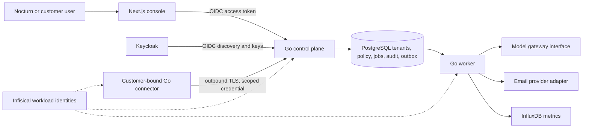

# Nocturn Operations

A tenant-aware foundation for operating AegisCore deployments. This repository contains a Next.js console, a Go control-plane API, a Go worker, a separate outbound customer connector, PostgreSQL migrations, a versioned OpenAPI contract, and fictional demo data.

**Current status:** development foundation. The demo uses mock model and email adapters; its operations are simulated. Do not connect a production customer or enable production operations until the [production gates](docs/production-readiness.md) are complete.

## Architecture



The API derives tenant access from a verified Keycloak identity and server-side membership. All customer queries include tenant scope. The connector credential is bound to one tenant and can be revoked. A DNS challenge identifies domain control; it never grants infrastructure permission. Policies, approvals, and kill switches gate action dispatch. The production execution adapter is intentionally absent: only the demo worker simulates a result.

## Repository map

| Path | Purpose |
| --- | --- |
| `web/` | Next.js App Router console, OIDC code flow with PKCE, server-side API proxy |
| `cmd/control-plane/` | HTTP API and identity, tenant, onboarding, audit, policy routes |
| `cmd/worker/` | PostgreSQL job and notification outbox consumers |
| `cmd/connector/` | Independently deployable, outbound, tenant-bound TCP health connector |
| `internal/platform/` | Domain logic, OIDC verifier, policy checks, mock gateway |
| `contracts/openapi.yaml` | Versioned HTTP contract; generates `web/src/lib/api.generated.ts` |
| `db/` | PostgreSQL migrations and fictional demo seed |
| `deploy/postgres_tenant_reader.sql` | Restricted tenant-read role and row policies for production configuration |
| `deploy/keycloak/themes/nocturn/` | Nocturn login-page mark and favicon for the external Keycloak sign-in page |
| `docs/` | Architecture, threat model, runbooks, and production gates |

## Local demo

Requires Go 1.27, Node.js 24, npm, Docker, and PostgreSQL image `postgres:17-alpine`. Official release references are in [deployment notes](docs/deployment.md).

1. Copy `.env.example` to a private local environment file. Set a random `DEMO_DB_PASSWORD`, and use a local `DATABASE_URL` pointing to `127.0.0.1:55433`. Set `APP_MODE=demo`, `LISTEN_ADDR=127.0.0.1:8090`, `API_URL=http://127.0.0.1:8090`, and `EMAIL_MODE=mock`. Never commit the file.
2. Start the isolated database: `docker compose --env-file .env.demo.local -f compose.demo.yaml up -d`.
3. Load the environment and run `go run ./cmd/migrate`. Load `db/demo_seed.sql` with `psql` inside the demo container. The seed uses only reserved `.example` and `.invalid` names.
4. Run `go run ./cmd/control-plane` and `go run ./cmd/worker` in separate terminals with the same environment.
5. Run `npm ci`, `npm run api:types`, and `npm run dev` with `APP_MODE=demo` and `API_URL=http://127.0.0.1:8090`. Visit `http://127.0.0.1:3000/fleet`.

Demo mode binds the Go API and Next.js development server to loopback. The API accepts a local-only `X-Demo-Actor` header. Production mode does not accept this header and requires Keycloak. Demo connectors, incidents, and metrics are fictional. No email is sent by the mock adapter.

## Checks

```powershell
go test ./cmd/... ./internal/...
go build ./cmd/... ./internal/...
npm run api:types
npm run types
npm run lint
npm run build
go run ./cmd/audit-verify
```

The last command needs `DATABASE_URL`. The verifier checks the append-only hash chain; a production deployment should additionally anchor chain heads outside the database.

## Operational boundaries

- The customer connector performs only locally configured TCP probes against IP ranges listed in its local config. It accepts no remote shell or arbitrary target from the control plane.
- Model calls are outside web requests. The current gateway is a local mock; production provider credentials and adapters are not configured.
- The HTTP email adapter posts a minimal event payload to a configured HTTPS delivery service with an idempotency key. The mock marks records `simulated`, never `delivered`.
- InfluxDB writes are asynchronous jobs. PostgreSQL retains the latest tenant-scoped telemetry for the console and queue durability.
- Custom edge hostnames are recorded in the domain schema, but Cloudflare/Akamai provisioning and verified host routing are production gates. The console reports edge status `unconfigured` until an integration confirms it.

See [architecture](docs/architecture.md), [security](docs/security.md), [deployment](docs/deployment.md), and [operations](docs/operations.md).

## Repo knowledge graph

Graphify generated a [machine-readable graph](docs/knowledge-graph/graphify-out/graph.json), an [interactive HTML view](docs/knowledge-graph/graphify-out/graph.html), and a [community report](docs/knowledge-graph/graphify-out/GRAPH_REPORT.md). Rebuild with `graphify extract . --code-only --out docs/knowledge-graph` followed by `graphify cluster-only docs/knowledge-graph --no-label`. The current extraction covers code symbols and relationships; Graphify's local code-only mode skips prose documents, and this installation did not emit SQL schema nodes. The architecture and schema documentation remain in `docs/` and `db/`.
