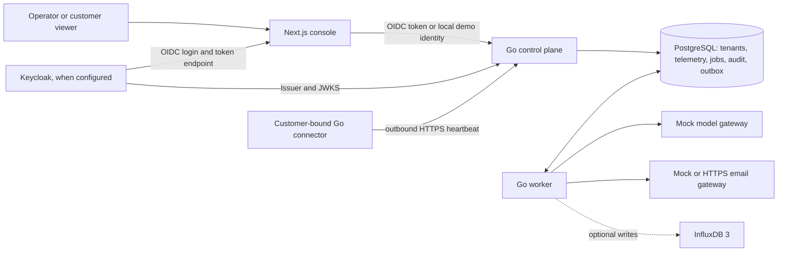

# Nocturne AegisOps

Nocturne AegisOps is a multi-tenant operations console and Go control plane for monitoring AegisCore deployments and reviewing proposed infrastructure actions.

**Status: development foundation.** The repository runs a fictional, local demo. The AI gateway and operation results are mocked, and several deployment and security controls still need implementation and validation. Do not connect a real customer environment or treat simulated operations as production changes. See the [production readiness gates](docs/production-readiness.md).

## What is implemented

- A Next.js and TypeScript console with fleet, customer, incident, investigation, approval, audit, and settings views. The demo marks fictional data and distinguishes stale telemetry and disconnected connectors.
- A Go HTTP control plane with tenant records, domain DNS TXT challenges, connector enrollment and revocation, telemetry, incidents, policies, approval records, audit search, and notification status. Its [versioned OpenAPI contract](contracts/openapi.yaml) generates the [frontend API types](web/src/lib/api.generated.ts).
- Keycloak OIDC authorization code with PKCE in the console and token verification, role checks, and tenant membership checks in the API. The local demo uses a loopback-only demo identity instead of Keycloak.
- PostgreSQL migrations, fictional seed data, a durable `jobs` table, and a notification outbox. A separate Go worker leases jobs, retries failures, and runs mock investigations and simulated operations.
- A separately deployable, tenant-bound Go connector that sends outbound HTTPS heartbeats for locally configured TCP probes. It does not accept remote commands or probe targets from the control plane.
- A hash-chained PostgreSQL audit trail and a verifier. The email outbox supports disabled, mock, and HTTPS gateway modes; mock delivery is labeled `simulated`.
- Optional InfluxDB 3 writes for numeric telemetry. Current console graphs read samples from PostgreSQL.
- Server-side Cloudflare Turnstile validation on the public contact API when configured. The console has no Turnstile widget or public contact form. Edge status is informational and defaults to `unconfigured`.

## Still needed for production

Reviewed connector operation tools and real execution, an approved AI provider adapter, a deployed Keycloak realm with MFA, scoped secrets delivery, a production email gateway and delivery reconciliation, broader database role isolation, external audit anchoring, backup and restore drills, alert routing, and end-to-end security testing remain open. Cloudflare/Akamai API integration, custom hostname provisioning and routing, and certificate lifecycle management are not implemented. See the [full gate list](docs/production-readiness.md).

## Architecture



The API authorizes tenant access using the authenticated actor and server-side membership. A connector credential binds to one tenant. DNS control is an onboarding check, not permission to access infrastructure. Policy and approval records gate dispatch; the worker only simulates operations today. Production customer detail reads can use a separate PostgreSQL row-level-security reader role, but other database paths still need role separation. See [architecture](docs/architecture.md) and [security](docs/security.md).

| Component | Repository location | Current role |
| --- | --- | --- |
| Next.js 16, React 19, TypeScript | [`web/`](web/) | Server-rendered console and API proxy |
| Go 1.27 | [`cmd/`](cmd/), [`internal/platform/`](internal/platform/) | Control plane, worker, connector, migrations, audit verifier |
| PostgreSQL 17 | [`db/`](db/), [`compose.demo.yaml`](compose.demo.yaml) | Application records, recent telemetry, durable jobs and outbox |
| InfluxDB 3 | [`internal/platform/`](internal/platform/) | Optional asynchronous metric writes; not in the demo Compose file |
| Keycloak | [`deploy/keycloak/`](deploy/keycloak/) | External OIDC identity provider; theme assets included, server not bundled |
| Infisical | [deployment guidance](docs/deployment.md) | Recommended production secret delivery; no runtime integration in this repo |

The durable queue is PostgreSQL-backed; Redis or Valkey is not required by this implementation.

## Screenshots

No product screenshots are checked in. Run the local demo to inspect the console. The [product mark](web/public/brand/nocturn-mark.png) is an asset, not a screenshot.

## Prerequisites

- Go 1.27, as specified in [`go.mod`](go.mod).
- Node.js 24 and npm, matching [CI](.github/workflows/ci.yaml).
- Docker with the Compose plugin for the local PostgreSQL container.
- A PowerShell terminal for the commands below. CI also builds on Ubuntu; no broader development OS support matrix has been validated.

The demo Compose file starts **only PostgreSQL**, bound to `127.0.0.1:55433`. It does not start Keycloak, InfluxDB, an email provider, or a customer connector.

## Quick start: fictional local demo

Run these commands from the repository root. Create an ignored `.env.demo.local` file with the following values, replacing `<random-local-password>` with a local alphanumeric password. Use the same password in both entries; URL-encode it if it contains URL-reserved characters.

```dotenv
APP_MODE=demo
DEMO_DB_PASSWORD=<random-local-password>
DATABASE_URL=postgres://nocturn_demo:<random-local-password>@127.0.0.1:55433/nocturn_ops?sslmode=disable
LISTEN_ADDR=127.0.0.1:8090
API_URL=http://127.0.0.1:8090
PUBLIC_URL=http://127.0.0.1:3000
EMAIL_MODE=mock
```

Create this file from the block above rather than copying [`.env.example`](.env.example): that example targets production and includes a placeholder `TENANT_READ_DATABASE_URL`. Leave `TENANT_READ_DATABASE_URL` unset for the demo.

Start PostgreSQL, then load the environment into the terminal that will run migrations:

```powershell
docker compose --env-file .env.demo.local -f compose.demo.yaml up -d --wait
Get-Content .env.demo.local | ForEach-Object { if ($_ -match '^([A-Z_]+)=(.*)$') { Set-Item -Path "Env:$($matches[1])" -Value $matches[2] } }
go run ./cmd/migrate
Get-Content db/demo_seed.sql -Raw | docker compose --env-file .env.demo.local -f compose.demo.yaml exec -T postgres psql -X -U nocturn_demo -d nocturn_ops -v ON_ERROR_STOP=1
```

Open three terminals at the repository root. Load `.env.demo.local` into **each** terminal using the `Get-Content ... | ForEach-Object ...` command above, then run one service per terminal:

```powershell
go run ./cmd/control-plane
```

```powershell
go run ./cmd/worker
```

```powershell
npm ci
npm run dev
```

Visit <http://127.0.0.1:3000/fleet>. The API readiness endpoint is <http://127.0.0.1:8090/health/ready>. The console and API listen on loopback in demo mode; the seeded universities, connectors, incidents, and telemetry are fictional. The worker does not send real email or execute infrastructure changes.

To discard the **entire local demo database**, stop the services and run `docker compose --env-file .env.demo.local -f compose.demo.yaml down --volumes`, then repeat the database startup, migration, and seed commands. The seed is intended for a fresh demo database.

## Configuration and service setup

The checked-in [`.env.example`](.env.example) is a production-oriented variable reference, not a ready-to-run deployment file. Keep local secret values in ignored files; inject production credentials through scoped workload identities or a secret manager. Variables are read by the Go processes and/or Next.js server at startup.

| Variable | Used for |
| --- | --- |
| `APP_MODE` | `demo` enables loopback-only demo access; default is `production` |
| `DATABASE_URL` | PostgreSQL connection for API, worker, migrations, and audit verifier |
| `TENANT_READ_DATABASE_URL` | Separate restricted reader required by the production control plane |
| `LISTEN_ADDR`, `API_URL`, `PUBLIC_URL` | Go listener, console-to-API URL, and canonical console URL |
| `OIDC_ISSUER`, `OIDC_AUDIENCE`, `OIDC_CLIENT_ID` | Keycloak issuer/API audience and console client; needed outside demo mode |
| `EMAIL_MODE`, `EMAIL_PROVIDER_URL`, `EMAIL_PROVIDER_TOKEN` | `disabled`, `mock`, or HTTPS delivery gateway; gateway URL/token needed for `http` |
| `INFLUX_URL`, `INFLUX_DATABASE`, `INFLUX_TOKEN` | Optional InfluxDB 3 write destination |
| `TURNSTILE_SECRET`, `TURNSTILE_HOSTNAME`, `TURNSTILE_ACTION` | Optional server-side verification for `/v1/public/contact` |
| `TRUSTED_PROXY_CIDRS` | Explicitly trusted proxy networks for forwarded request provenance |
| `DEMO_DB_PASSWORD` | Compose-only password for local PostgreSQL |
| `CONNECTOR_CREDENTIAL` | Customer connector bearer credential, supplied only to that connector |

Migrations live in [`db/`](db/) and are applied once by `go run ./cmd/migrate`. [`db/demo_seed.sql`](db/demo_seed.sql) contains reserved `.example` and `.invalid` names. For production, a database administrator must additionally apply [`deploy/postgres_tenant_reader.sql`](deploy/postgres_tenant_reader.sql), create a non-owner reader login, and set `TENANT_READ_DATABASE_URL`; see [deployment guidance](docs/deployment.md). No production database provisioning or reset command is supplied.

For Keycloak, configure the realm, clients, redirect URI, roles, and MFA as described in [deployment guidance](docs/deployment.md). The console implements authorization code with PKCE and the API checks issuer, audience, roles, and tenant membership. Keycloak is not part of the demo Compose stack. The optional [login theme](deploy/keycloak/README.md) must be installed and selected separately.

Connector enrollment is described in [deployment guidance](docs/deployment.md). It requires a customer authorization record, DNS TXT verification, a one-time enrollment token, and monitoring approval. The [`cmd/connector/`](cmd/connector/) binary reads a local JSON config supplied with `-config` and `CONNECTOR_CREDENTIAL`; it requires an HTTPS control-plane URL and only probes configured hosts, ports, and allowed CIDRs. The HTTP loopback demo API is **not** a connector endpoint. Demo connector rows are seeded fixtures, not running agents.

## Checks and builds

These commands are defined by the project scripts or used in [CI](.github/workflows/ci.yaml):

```powershell
go test ./cmd/... ./internal/...
go build ./cmd/... ./internal/...
npm ci
npm run api:types
npm run lint
npm run types
npm run build
```

`npm run api:types` regenerates `web/src/lib/api.generated.ts` from `contracts/openapi.yaml`; CI checks that the generated file has no diff. With `DATABASE_URL` set, `go run ./cmd/audit-verify` checks the stored audit hash chain. There is no repository-wide formatting script; format Go changes with `gofmt` and check frontend style with `npm run lint`.

## Deployment and security boundaries

[`deploy/Dockerfile.go`](deploy/Dockerfile.go) builds the Go binaries independently; [`deploy/Dockerfile.web`](deploy/Dockerfile.web) builds the console. The repository does not include a production Compose stack, Kubernetes manifests, or infrastructure provisioning. Use the [deployment notes](docs/deployment.md), [operations runbooks](docs/operations.md), [threat model](docs/security.md), and [production gates](docs/production-readiness.md) to plan a deployment.

Tenant authorization is checked in the API, while a separate PostgreSQL reader role and row policies can protect selected customer detail reads in production. Policies, exact-parameter approvals, and kill switches exist, but there is no production operation executor. The audit trail is hash-chained in PostgreSQL; external anchoring, retention controls, and restore validation remain open. Never put provider credentials or customer data in the browser, source, model prompts, or demo seed. The model gateway currently uses a mock provider. Turnstile validation protects only the configured public contact API; Cloudflare/Akamai edge controls and custom domain activation require external work and are not asserted as active by this repository.

The [Graphify knowledge graph](docs/knowledge-graph/README.md) is a generated code-navigation aid. Its extraction does not replace the source, schema, or security documentation.

## Project information

No license file, formal contribution guide, or support contact is included in this repository. Confirm those terms with the project owner before external use or contribution.
